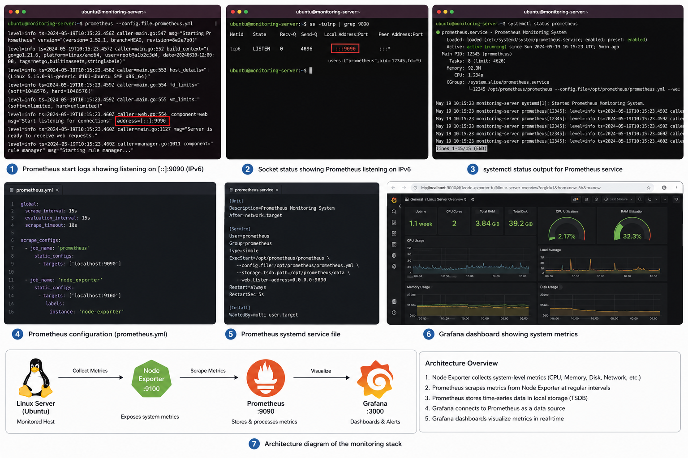

# 🖥️ Linux Monitoring Stack

A production-style monitoring system built from scratch on Ubuntu Linux using Prometheus, Node Exporter, and Grafana — all configured manually as systemd services.

> Built to understand how real observability stacks work under the hood, beyond surface-level tools like `htop`.

---

## 📐 Architecture

```
Ubuntu Server
      │
      ▼
Node Exporter (Port 9100)
  └── Collects: CPU · Memory · Disk · Network metrics
      │
      ▼
Prometheus (Port 9090)
  └── Scrapes Node Exporter every 15s · Stores time-series data
      │
      ▼
Grafana (Port 3000)
  └── Visualizes metrics · Dashboards · Alerting
```

---

## 🛠️ Tech Stack

| Tool | Purpose |
|---|---|
| Ubuntu Linux | Operating system |
| Prometheus `v3.9.1` | Metrics scraping and storage |
| Node Exporter `v1.9.0` | Linux system metrics exporter |
| Grafana | Dashboard visualization |
| systemd | Service management and auto-restart |

---

## 📁 Project Structure

```
linux-monitoring-stack/
├── README.md
├── prometheus/
│   ├── prometheus.yml          # Scrape config (Prometheus + Node Exporter)
│   └── prometheus.service      # systemd unit file
├── node_exporter/
│   └── node_exporter.service   # systemd unit file
├── scripts/
│   ├── install_prometheus.sh   # Automated Prometheus install script
│   └── install_node_exporter.sh # Automated Node Exporter install script
├── docs/
│   ├── installation-steps.md   # Manual step-by-step setup guide
│   ├── troubleshooting.md      # Real errors hit and how they were fixed
│   └── architecture.md         # Architecture and design decisions
└── screenshots/                # Grafana dashboards, Prometheus targets, logs
```

---

## 🚀 Quick Start

### Option A — Automated (scripts)

```bash
# Install Node Exporter
chmod +x scripts/install_node_exporter.sh
sudo ./scripts/install_node_exporter.sh

# Install Prometheus
chmod +x scripts/install_prometheus.sh
sudo ./scripts/install_prometheus.sh
```

### Option B — Manual (step by step)

See [`docs/installation-steps.md`](docs/installation-steps.md)

---

## ✅ Verify Services Are Running

```bash
systemctl status node_exporter
systemctl status prometheus
systemctl status grafana-server
```

Check listening ports:

```bash
sudo ss -tulnp | grep -E '9090|9100|3000'
```

---

## 🌐 Access the Stack

| Service | URL |
|---|---|
| Prometheus | http://localhost:9090 |
| Node Exporter metrics | http://localhost:9100/metrics |
| Grafana | http://localhost:3000 |

Grafana default credentials: `admin / admin`

**Grafana data source setup:**
- Type: `Prometheus`
- URL: `http://127.0.0.1:9090`

---

## 🔧 Useful Commands

```bash
# View live logs
journalctl -u prometheus -f
journalctl -u node_exporter -f

# Validate Prometheus config before restarting
./promtool check config prometheus.yml

# Reload Prometheus config without restart
curl -X POST http://localhost:9090/-/reload
```

---

## 🐛 Troubleshooting

Real errors encountered during setup and how they were resolved — see [`docs/troubleshooting.md`](docs/troubleshooting.md).

| Error | Cause | Fix |
|---|---|---|
| `Exec format error` | Wrong binary architecture | Downloaded `linux-amd64` build |
| `field static_configs already set` | Duplicate YAML block | Merged into single `static_configs` |
| `Permission denied` on data dir | Root-owned directory | `chown -R $USER /opt/prometheus/data` |
| Prometheus on `[::]:9090` only | IPv6-only binding | Added `--web.listen-address=0.0.0.0:9090` |

---

## 💡 Key Skills Demonstrated

- Linux administration and service management
- Prometheus configuration and PromQL
- Grafana dashboard setup and data source configuration
- systemd unit file creation and management
- Linux networking diagnostics (`ss`, `journalctl`, `netstat`)
- YAML configuration and validation
- Real-world troubleshooting and debugging

---

## 🔮 Future Improvements

- [ ] Dockerize the full stack with Docker Compose
- [ ] Add Alertmanager with email notifications
- [ ] Add Blackbox Exporter for endpoint monitoring
- [ ] Monitor multiple Linux servers
- [ ] Configure Grafana alert rules tied to SLOs

---

## 📸 Screenshots

### Full Stack Overview


*Clockwise from top-left: Prometheus start logs (IPv6 binding issue), socket status via `ss`, systemctl service status, live Grafana dashboard (CPU/RAM/Disk), Prometheus systemd service file, prometheus.yml config, and architecture diagram.*
---

## 👤 Author

**Ramit Basra** — [GitHub](https://github.com/basraramit) · [LinkedIn](https://linkedin.com/in/ramit-basra)
